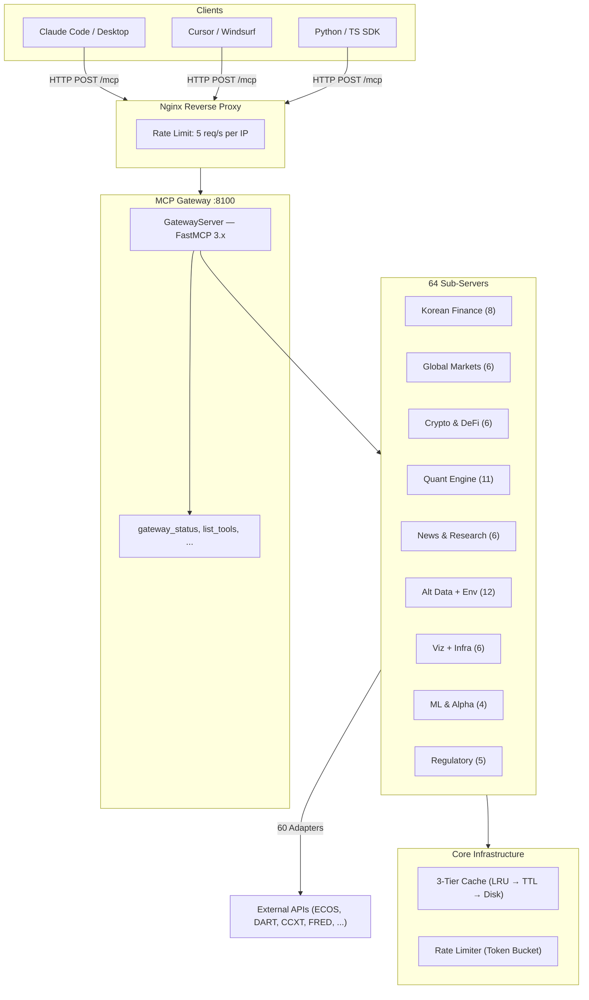

<p align="center">
  <h1 align="center">Nexus Finance MCP</h1>
  <p align="center">
    <strong>Finance & Research Intelligence Platform</strong>
  </p>
  <p align="center">
    396 tools · 64 servers · One endpoint · Ask anything about markets, macro, quant, or research.
  </p>
  <p align="center">
    <a href="#quick-start"></a>
    <a href="#tool-overview"></a>
    <a href="#api-keys"></a>
  </p>
  <p align="center">
    
    
    
    
    
    
    
    <a href="https://smithery.ai"></a>
  </p>
</p>

---

Connect any MCP client and start asking questions — about Korean equities, US macro, crypto derivatives, academic papers, climate data, or portfolio optimization. Built for AI agents by [Luxon AI](https://github.com/pollmap).

## Table of Contents

- [What You Can Do](#what-you-can-do)
- [Features](#features)
- [Supported Clients](#supported-clients)
- [Quick Start](#quick-start)
- [Installation](#installation)
- [Tool Overview](#tool-overview)
- [Response Format](#response-format)
- [Example Workflows](#example-workflows)
- [Getting the Best Output](#getting-the-best-output)
- [API Keys](#api-keys)
- [Architecture](#architecture)
- [Documentation](#documentation)
- [Data Policy](#data-policy)
- [Contributing](#contributing)
- [Changelog](#changelog)
- [Star History](#star-history)
- [License](#license)

## What You Can Do

| Ask your AI... | What happens behind the scenes | What you get |
|---|---|---|
| "Analyze Samsung Electronics as an investment" | `stocks_quote` → `dart_financial_statements` → `dart_financial_ratios` → `val_dcf_valuation` → `val_peer_comparison` → `viz_bar_chart` | DCF fair value + peer multiples chart |
| "Compare US and Korean interest rate policy" | `ecos_get_base_rate` → `macro_fred` → `quant_granger_causality` → `ts_forecast` → `viz_dual_axis` | Granger causality test + 12-month forecast + dual-axis chart |
| "Survey recent papers on transformer financial forecasting" | `academic_multi_search` → `academic_citations` → `academic_paper_detail` | Top 10 papers ranked by citations with abstracts |
| "Is BTC funding rate signaling a reversal?" | `cquant_funding_rate` → `cquant_basis_term` → `onchain_adv_mvrv` → `cquant_open_interest` | Multi-signal quant dashboard |
| "Build a momentum + value factor portfolio" | `factor_score` → `factor_correlation` → `portadv_hrp` → `backtest_portfolio` → `backtest_drawdown` | Optimized portfolio with Sharpe ratio + drawdown analysis |
| "How does El Nino affect Korean agriculture prices?" | `climate_enso_index` → `agri_kamis_prices` → `quant_lagged_correlation` → `viz_heatmap` | Climate-price correlation heatmap |

## Features

| Feature | Description |
|---------|-------------|
| **396 Tools / 64 Servers** | World's largest financial MCP — Korean + global markets, quant, crypto, alternative data |
| **Single Gateway** | One endpoint, all tools — FastMCP mount architecture with streamable-http transport |
| **Real Data Only** | Zero mock/sample data. Every response comes from live APIs with graceful error handling |
| **PhD-Level Quant** | GARCH, Heston, Black-Litterman, HRP, Kalman filter, Lopez de Prado ML pipeline |
| **150+ Year History** | Shiller (1871~), NBER cycles (1854~), French factors (1926~), FRED century-scale |
| **33 Chart Types** | Line, candlestick, heatmap, treemap, sankey, choropleth map, violin, radar, and more |
| **Research Intelligence** | arXiv, Semantic Scholar, RISS, PubMed, GDELT, Google Trends, patents, 14 RSS feeds |
| **Semantic Memory** | Hybrid vector + BM25 search, Obsidian Vault integration, ontology graph |
| **Smithery Ready** | Listed on [Smithery](https://smithery.ai) marketplace — plug and play |
| **Open Access** | No authentication required — connect instantly from any MCP client ([Connection Guide](CONNECT.md)) |

## Supported Clients

Works with any MCP-compatible client:

| Client | Transport | Setup |
|--------|-----------|-------|
| **Claude Desktop** | streamable-http | Add to `claude_desktop_config.json` ([details](#option-1-remote-hosted)) |
| **Claude Code** | streamable-http | `claude mcp add nexus-finance ...` ([details](#option-1-remote-hosted)) |
| **Cursor** | streamable-http | Settings → MCP → Add server URL |
| **Windsurf** | streamable-http | Settings → MCP Servers → Add |
| **Cline (VS Code)** | streamable-http | Extension settings → MCP Servers |
| **Continue** | streamable-http | `config.json` → mcpServers |
| **ChatGPT (Actions)** | HTTP | Via OpenAPI schema wrapper |
| **Custom HTTP Client** | streamable-http | `POST http://host:8100/mcp` |
| **Smithery** | stdio | One-click install on [smithery.ai](https://smithery.ai) |

> Any client supporting [MCP streamable-http transport](https://modelcontextprotocol.io) can connect.

## Quick Start

### Option 1: Remote (Hosted)

Connect instantly — no installation required.

**Claude Code (one command):**

```bash
claude mcp add nexus-finance --transport streamable-http --url http://62.171.141.206/mcp
```

**Claude Desktop (`claude_desktop_config.json`):**

```json
{
  "mcpServers": {
    "nexus-finance": {
      "url": "http://62.171.141.206/mcp",
      "transport": "streamable-http"
    }
  }
}
```

> **Config location:** Windows `%APPDATA%\Claude\claude_desktop_config.json` · macOS `~/Library/Application Support/Claude/claude_desktop_config.json`
>
> No authentication required. Just add the URL and connect.  
> For Cursor, Windsurf, Python/TS SDK, and cURL examples, see the **[Connection Guide](CONNECT.md)**.

**Hosted server notes:**
- HTTP only (HTTPS coming soon) — do not send sensitive data in tool parameters
- Rate limit: 5 req/s per IP on `/mcp` endpoint (burst 10)
- Best-effort uptime — single VPS, no SLA
- All API keys pre-configured — all 396 tools work immediately

### Option 2: Self-Hosted

```bash
git clone https://github.com/pollmap/nexus-finance-mcp.git
cd nexus-finance-mcp
pip install -r requirements.txt
cp .env.template .env   # Fill in your API keys
python server.py --transport streamable-http --port 8100
```

### Option 3: Docker

```bash
docker build -t nexus-finance-mcp .
docker run -p 8100:8100 --env-file .env nexus-finance-mcp
```

### Option 4: Smithery

Search "nexus-finance" on [smithery.ai](https://smithery.ai) and install directly.

### Your First Query

After connecting, try:

> "What's Samsung Electronics' current stock price and key financial ratios?"

Claude will automatically call `stocks_quote("005930")` and `dart_financial_ratios("삼성전자")` to get live data.

## Installation

### Requirements

- **Python 3.12+**
- API keys (see [API Keys](#api-keys) — most tools work without any keys)

### Environment Variables

Copy `.env.template` to `.env` and configure:

```bash
# === Required (core Korean data) ===
BOK_ECOS_API_KEY=        # 한국은행 ECOS (https://ecos.bok.or.kr)
DART_API_KEY=            # OpenDART (https://opendart.fss.or.kr)

# === Recommended ===
KOSIS_API_KEY=           # 통계청 KOSIS (https://kosis.kr)
FRED_API_KEY=            # Federal Reserve FRED (https://fred.stlouisfed.org)

# === Optional (expand coverage) ===
FINNHUB_API_KEY=         # 미국 주식 (https://finnhub.io)
ETHERSCAN_API_KEY=       # 이더리움 온체인 (https://etherscan.io)
EIA_API_KEY=             # 미국 에너지 (https://www.eia.gov)
NAVER_CLIENT_ID=         # 네이버 뉴스 (https://developers.naver.com)
NAVER_CLIENT_SECRET=
KIS_API_KEY=             # 한국투자증권 실시간
NASA_API_KEY=            # NASA (DEMO_KEY works without registration)
ENTSOE_API_KEY=          # ENTSO-E European Grid
ACLED_API_KEY=           # ACLED Conflict Data

# === Server Config ===
MCP_TRANSPORT=streamable-http
MCP_HOST=127.0.0.1
MCP_PORT=8100
MCP_AUTH_TOKEN=          # Bearer token (optional)
```

### Transport Options

| Transport | Command | Use Case |
|-----------|---------|----------|
| `streamable-http` | `python server.py --transport streamable-http --port 8100` | Production (Claude Desktop, remote) |
| `stdio` | `python server.py --transport stdio` | Local (Smithery, direct pipe) |

## Tool Overview

At a glance — 396 tools across 15 domains:

| Domain | Servers | Tools | Highlights |
|--------|---------|-------|------------|
| **Korean Economy** | 5 | 41 | ECOS, DART 20종, KOSIS, FSC, KRX/pykrx |
| **Korean Real Estate** | 2 | 8 | 아파트 실거래가, 매매/전세 지수, PIR |
| **Global Markets** | 6 | 37 | US/Asia/India equities, SEC EDGAR, EDINET, FRED |
| **Crypto & DeFi** | 6 | 36 | CCXT 100+ exchanges, on-chain, DeFi TVL, funding rate |
| **News & Research** | 6 | 31 | Naver, GDELT, RSS 14개, arXiv, RISS, Semantic Scholar |
| **Real Economy** | 7 | 31 | Energy, agriculture, maritime, aviation, trade, consumer |
| **Regulatory & Environment** | 6 | 26 | Valuation DCF, EU regulation, FDA, EPA, patents |
| **Quant Alternative Data** | 5 | 32 | Space weather, disasters, climate, conflict, power grid |
| **Analysis & Visualization** | 2 | 38 | Technical indicators + 33 chart types (Plotly/Matplotlib) |
| **Quant Engine** | 3 | 22 | Correlation, Granger, ARIMA, backtest with 6 strategies |
| **Professional Quant** | 3 | 18 | Factor engine, signal lab, portfolio optimization |
| **PhD-Level Math** | 3 | 18 | GARCH, Kalman, Hurst, wavelets, 150-year history |
| **Academic Alpha** | 4 | 24 | Stat arb, Black-Litterman, Heston, microstructure VPIN |
| **Crypto Quant + ML** | 4 | 24 | Lopez de Prado ML, alpha research, funding arb |
| **Infrastructure** | 5 | 25 | Obsidian Vault, semantic memory, ontology, gateway meta |
| | **64** | **396** | |

> **Full tool reference with function signatures:** [Tool Catalog](docs/TOOL_CATALOG.md)

## Response Format

All tools return structured JSON. Example:

### `stocks_quote("005930")` — Samsung Electronics

```json
{
  "name": "삼성전자",
  "code": "005930",
  "price": 67800,
  "change": -200,
  "change_pct": -0.29,
  "volume": 12345678,
  "market_cap": 404700000000000,
  "per": 12.5,
  "pbr": 1.2,
  "high_52w": 88800,
  "low_52w": 53000
}
```

### `ecos_get_base_rate()`

```json
{
  "indicator": "한국은행 기준금리",
  "value": 2.75,
  "unit": "%",
  "date": "2025-11",
  "source": "BOK ECOS"
}
```

### Error Response

```json
{
  "error": true,
  "message": "DART API key not configured. Set DART_API_KEY in .env"
}
```

> All error responses include a descriptive `message` field. No fake/fallback data is ever returned.

## Example Workflows

### 1. Korean Equity Deep Dive

> **Scenario**: Your investment club asks you to evaluate Samsung Electronics for the next quarter.

**Ask Claude:**
> "Analyze Samsung Electronics (005930) — get current price, 3-year financials, DCF valuation, and compare against semiconductor peers with a bar chart."

**What runs:** `stocks_quote` → `dart_financial_statements` → `val_dcf_valuation` → `val_peer_comparison` → `viz_bar_chart`

**You get:** DCF-based fair value estimate, peer multiples comparison, and a publication-ready chart.

### 2. Macro Policy Research

> **Scenario**: You're writing a research note on whether the Fed leads or follows the BOK.

**Ask Claude:**
> "Compare US and Korean base interest rates over the past 5 years. Run a Granger causality test and forecast Korean rates for 12 months."

**What runs:** `ecos_get_base_rate` → `macro_fred` → `quant_granger_causality` → `ts_forecast` → `viz_dual_axis`

**You get:** Causality test result, 12-month rate forecast, and a dual-axis chart showing the rate spread.

### 3. Academic Literature Survey

> **Scenario**: You need to survey recent ML papers on financial time series for a seminar presentation.

**Ask Claude:**
> "Search arXiv and Semantic Scholar for 'transformer financial forecasting' papers from 2024-2025. Get citation counts and rank the top 10."

**What runs:** `academic_multi_search` → `academic_citations` → `academic_paper_detail`

**You get:** Ranked list of papers with abstracts, citation counts, and direct links.

### 4. Crypto Quant Signal Pipeline

> **Scenario**: You manage a crypto fund and want to check if BTC perpetual funding rates indicate a crowded long.

**Ask Claude:**
> "Analyze BTC market structure: funding rates across exchanges, basis term structure, MVRV ratio, and open interest. Is there a funding rate arbitrage opportunity?"

**What runs:** `crypto_market_structure` → `cquant_funding_rate` → `cquant_basis_term` → `onchain_adv_mvrv` → `cquant_funding_arb`

**You get:** Multi-signal dashboard showing funding, basis, on-chain metrics, and a specific arb opportunity with expected carry.

### 5. Alternative Data Correlation

> **Scenario**: Your quant team hypothesizes that solar activity correlates with market volatility.

**Ask Claude:**
> "Get sunspot data from 1950 to present and compare with KOSPI returns using lagged correlation. Also check ENSO index and Korea's geopolitical risk score."

**What runs:** `space_sunspot_data` → `quant_lagged_correlation` → `climate_enso_index` → `conflict_country_risk` → `viz_heatmap`

**You get:** Correlation heatmap across lags, showing whether the sunspot-market hypothesis holds.

### 6. Competition Report Pipeline

> **Scenario**: You're preparing a finance competition submission analyzing Korean household debt risk.

**Ask Claude:**
> "Collect Korean household debt data from ECOS, compare with Japan/US/EU levels, run a time series decomposition, and create a choropleth map of regional debt concentration."

**What runs:** `ecos_get_stat_data` → `macro_country_compare` → `ts_decompose` → `viz_map_choropleth`

**You get:** Full data package with international comparison, trend decomposition, and geographic visualization.

### 7. Multi-Factor Portfolio Construction

> **Scenario**: You want to build and backtest a multi-factor Korean equity portfolio.

**Ask Claude:**
> "Score the top 50 KOSPI stocks on momentum, value, and quality factors. Optimize using Hierarchical Risk Parity and backtest against KOSPI for 3 years with drawdown analysis."

**What runs:** `factor_score` → `factor_correlation` → `portadv_hrp` → `backtest_portfolio` → `backtest_drawdown` → `viz_line_chart`

**You get:** Optimized portfolio with Sharpe ratio, maximum drawdown, and benchmark comparison chart.

### Built-in Backtest Strategies

| Strategy | Logic | Best For |
|----------|-------|----------|
| `RSI_oversold` | RSI < 30 buy, > 70 sell | Mean reversion |
| `MACD_crossover` | MACD-signal crossover | Trend reversal |
| `Bollinger_bounce` | Lower band touch | Volatility reversion |
| `MA_cross` | 20/50 golden cross | Medium-term trend |
| `Mean_reversion` | Mean -2σ buy | Statistical reversion |
| `Momentum` | N-day positive return | Momentum |

> All backtests include commission (0.18%) and tax (0.18%) by default.

## Getting the Best Output

| Tip | Example |
|-----|---------|
| **Be specific about assets** | Use stock codes (`005930`) or full names (`Samsung Electronics`) |
| **Specify time ranges** | "last 3 years" or "2020-2024" helps tools fetch the right window |
| **Ask for visualization** | Say "chart", "heatmap", or "plot" — Claude auto-calls viz tools |
| **Chain naturally** | "Get the data, analyze it, and show me a chart" triggers multi-tool pipelines |
| **Use Korean for Korean data** | `삼성전자`, `기준금리` — tools accept Korean names natively |
| **Explore first** | Start with `gateway_status()` to see all 64 servers and 396 tools |

## API Keys

| Key | Required | Coverage | Get it at |
|-----|----------|----------|-----------|
| `BOK_ECOS_API_KEY` | **Required** | 한국은행 30+ macro indicators | [ecos.bok.or.kr](https://ecos.bok.or.kr) |
| `DART_API_KEY` | **Required** | 금감원 20 disclosure tools | [opendart.fss.or.kr](https://opendart.fss.or.kr) |
| `KOSIS_API_KEY` | Recommended | 통계청 + 부동산원 | [kosis.kr](https://kosis.kr) |
| `FRED_API_KEY` | Recommended | US Fed + century-scale data | [fred.stlouisfed.org](https://fred.stlouisfed.org) |
| `FINNHUB_API_KEY` | Optional | US equities | [finnhub.io](https://finnhub.io) |
| `ETHERSCAN_API_KEY` | Optional | Ethereum on-chain | [etherscan.io](https://etherscan.io) |
| `EIA_API_KEY` | Optional | US energy data | [eia.gov](https://www.eia.gov) |
| `NAVER_CLIENT_ID/SECRET` | Optional | Korean news | [developers.naver.com](https://developers.naver.com) |
| `KIS_API_KEY` | Optional | Korean securities realtime | [apiportal.koreainvestment.com](https://apiportal.koreainvestment.com) |
| `NASA_API_KEY` | Optional | NASA (DEMO_KEY works) | [api.nasa.gov](https://api.nasa.gov) |

> **200+ tools require NO API keys** — quant analysis, backtesting, factor models, volatility, math, ML pipeline, visualizations, and most alternative data sources work out of the box.

## Architecture



> For detailed diagrams (request lifecycle, server tree, caching flow), see [docs/DATA_FLOW.md](docs/DATA_FLOW.md).

### Gateway Meta Tools

The gateway itself provides 6 tools for discovery and monitoring:

```
gateway_status()                    → Server health + version
list_available_tools()              → All 396 tool names
list_tools_by_domain("crypto")      → Filter by domain
list_tools_by_pattern("snapshot")   → Filter by input pattern
tool_info("stocks_quote")          → Tool schema + metadata
api_call_stats()                    → Daily call counts
```

## Documentation

| Document | Description |
|----------|-------------|
| **Getting Started** | |
| [Connection Guide](CONNECT.md) | Connect from Claude Code, Cursor, Windsurf, Python/TS SDK |
| [Quick Reference](docs/QUICK_REFERENCE.md) | One-page cheat sheet — top tools, patterns, limits |
| [Usage Guide](docs/USAGE_GUIDE.md) | 5 input patterns, workflow examples |
| **Reference** | |
| [Tool Catalog](docs/TOOL_CATALOG.md) | All 396 tools by domain and complexity tier |
| [Parsing Guide](docs/PARSING_GUIDE.md) | Response format spec, parsing strategies |
| [Error Reference](docs/ERROR_REFERENCE.md) | Error codes, retry strategies |
| **Architecture** | |
| [Architecture Diagrams](docs/DATA_FLOW.md) | Mermaid diagrams — system, data flow, server tree, caching |
| [Architecture Deep Dive](docs/ARCHITECTURE.md) | Technical internals, caching, rate limiting, dead code audit |
| [Coverage Audit](docs/COVERAGE_AUDIT.md) | API coverage by source + improvement roadmap |
| **Contributing** | |
| [Contributing Guide](CONTRIBUTING.md) | How to add servers, adapters, and tools |
| [Changelog](CHANGELOG.md) | Phase 1-14 evolution history |
| [Troubleshooting](docs/TROUBLESHOOTING.md) | Operational debugging guide |

## Data Policy

**Real data only.** No sample data, mock data, or fake data — ever.

- API call failure → clear error message with cause
- Missing API key → graceful fallback + log warning
- Rate limit hit → retry guidance in error response
- Never substitutes fake data for failed requests

## Contributing

See **[CONTRIBUTING.md](CONTRIBUTING.md)** for the full guide — project structure, server patterns, adapter templates, naming conventions.

Quick summary:

1. Fork the repo
2. Create adapter in `mcp_servers/adapters/` + server in `mcp_servers/servers/`
3. Register in `gateway_server.py` SERVERS list
4. Test and submit PR

## Changelog

See **[CHANGELOG.md](CHANGELOG.md)** for the full Phase 1-14 evolution history.

## Star History

<a href="https://star-history.com/#pollmap/nexus-finance-mcp&Date">
 <picture>
   <source media="(prefers-color-scheme: dark)" srcset="https://api.star-history.com/svg?repos=pollmap/nexus-finance-mcp&type=Date&theme=dark" />
   <source media="(prefers-color-scheme: light)" srcset="https://api.star-history.com/svg?repos=pollmap/nexus-finance-mcp&type=Date" />
   
 </picture>
</a>

## License

MIT

---

<p align="center">
  <strong>v8.0.0-phase14</strong> · 396 tools · 64 servers · Finance & Research Intelligence · Built by <a href="https://github.com/pollmap">Luxon AI</a>
</p>
