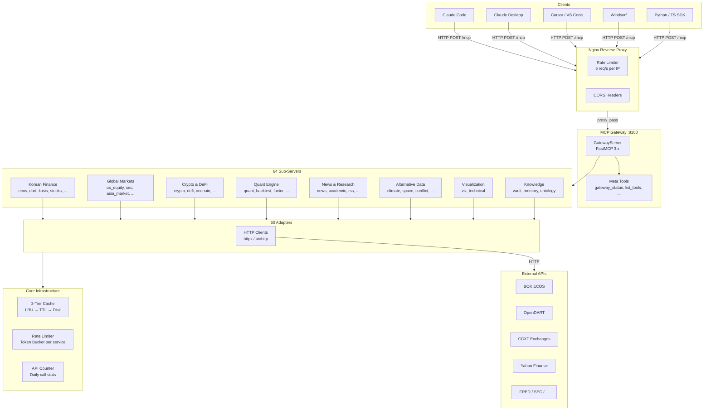
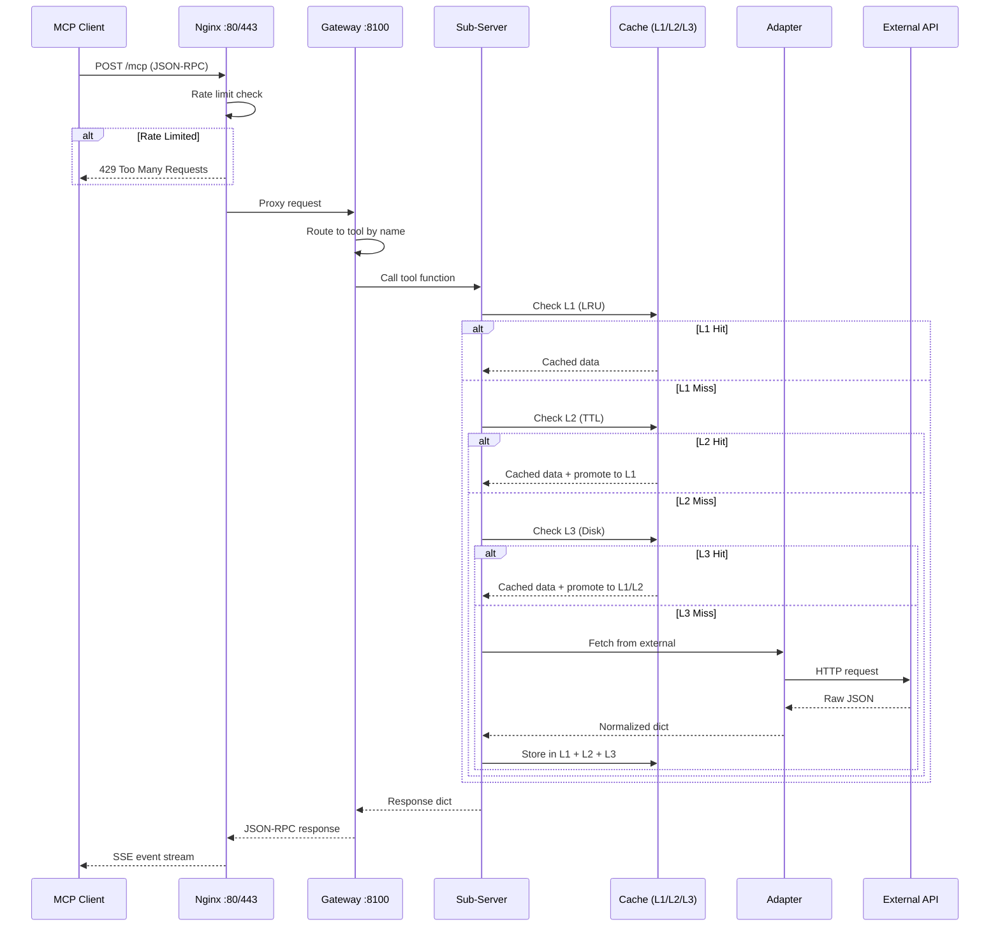
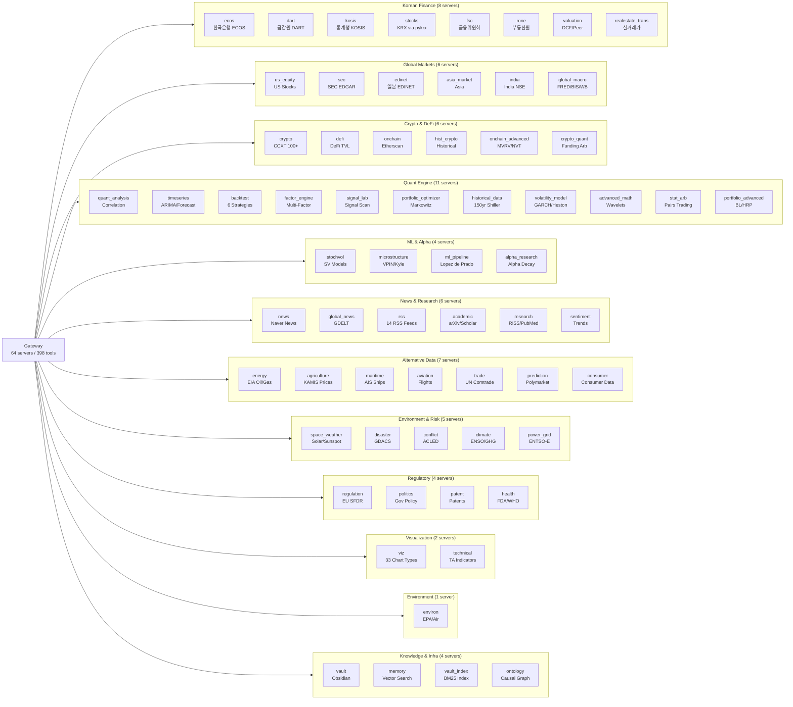
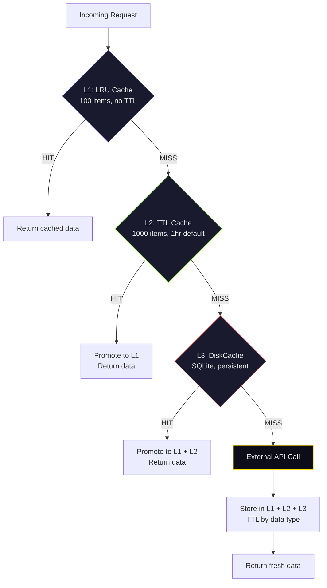
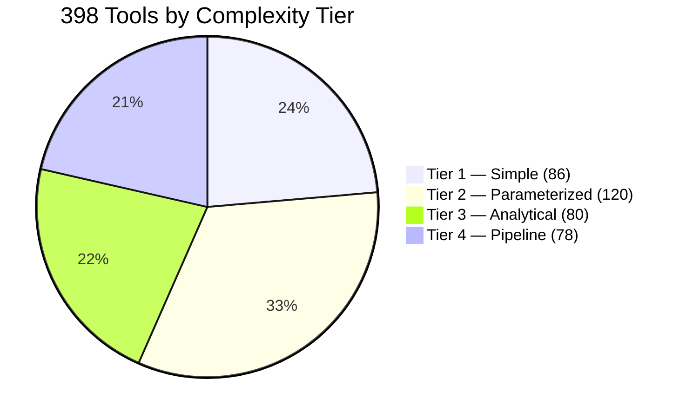
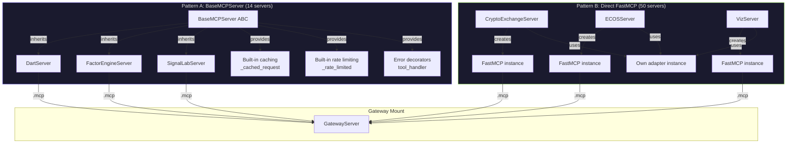

# Nexus Finance MCP — Architecture Diagrams

> Visual reference for system architecture, data flow, and server organization.  
> All diagrams use [Mermaid](https://mermaid.js.org/) — rendered natively by GitHub.

---

## 1. System Architecture

---

## 2. Request Lifecycle

---

## 3. Server Domain Tree

---

## 4. Caching Architecture (3-Tier)

### TTL by Data Type

| Type | TTL | Examples |
|------|-----|---------|
| `realtime_price` | 60s | Stock quotes, crypto tickers |
| `daily_data` | 1 hour | Daily OHLCV, news articles |
| `historical` | 24 hours | Historical time series |
| `static_meta` | 1 week | Company info, metadata |
| `default` | 1 hour | Everything else |

---

## 5. Tool Complexity Distribution

### Input Patterns

| Pattern | Description | Example |
|---------|-------------|---------|
| `snapshot` | Zero params, point-in-time | `ecos_get_macro_snapshot()` |
| `stock_code` | Korean equity code | `dart_company_info("005930")` |
| `series` | Date range time series | `ecos_get_base_rate("2020-01", "2024-12")` |
| `search` | Keyword text search | `academic_search("transformer forecasting")` |
| `data_columns` | Column selection from dataset | `kosis_get_data(table_id, columns)` |
| `composite` | Multi-step, chained calls | `backtest_run(stock, strategy, years)` |

---

## 6. Server Implementation Patterns

### When to Use Each Pattern

| | Pattern A (BaseMCPServer) | Pattern B (Direct FastMCP) |
|---|---|---|
| **Use when** | Building new servers (Phase 9+) | Quick prototype or simple wrapper |
| **Caching** | Built-in via `_cached_request()` | Manual adapter-level caching |
| **Rate limiting** | Built-in via `_rate_limited()` | Manual or via adapter |
| **Error handling** | `@tool_handler` decorator available | Inline try/except |
| **Examples** | dart, factor_engine, signal_lab | crypto_exchange, ecos, viz |

---

## Related Docs

- [ARCHITECTURE.md](ARCHITECTURE.md) — Detailed layer-by-layer technical docs
- [TOOL_CATALOG.md](TOOL_CATALOG.md) — Full tool listing by domain and tier
- [QUICK_REFERENCE.md](QUICK_REFERENCE.md) — Cheat sheet for daily use
