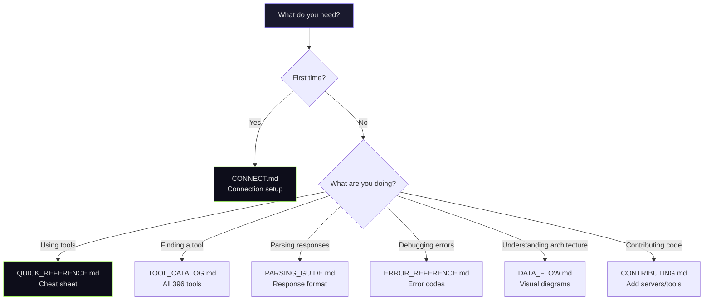

# Documentation

> Nexus Finance MCP — 396 tools / 64 servers  
> Navigate to the right doc for your use case.

## Which Doc Should I Read?

---

## Getting Started

| Doc | Description |
|-----|-------------|
| [CONNECT.md](../CONNECT.md) | Connection guide — Claude Code, Cursor, Windsurf, Python/TS SDK, cURL |
| [QUICK_REFERENCE.md](QUICK_REFERENCE.md) | One-page cheat sheet — top tools, patterns, rate limits |
| [USAGE_GUIDE.md](USAGE_GUIDE.md) | Full usage guide — 5 input patterns, 5 workflow examples |

## Reference

| Doc | Description |
|-----|-------------|
| [TOOL_CATALOG.md](TOOL_CATALOG.md) | All 396 tools by domain and complexity tier |
| [PARSING_GUIDE.md](PARSING_GUIDE.md) | Response format spec, domain-specific fields, parsing strategies |
| [ERROR_REFERENCE.md](ERROR_REFERENCE.md) | 5 error categories, retry strategies, rate limit handling |

## Architecture

| Doc | Description |
|-----|-------------|
| [DATA_FLOW.md](DATA_FLOW.md) | Mermaid diagrams — system architecture, request lifecycle, server tree, caching |
| [ARCHITECTURE.md](ARCHITECTURE.md) | Technical deep dive — layers, caching, rate limiting, dead code audit |
| [COMPETITIVE_ANALYSIS.md](COMPETITIVE_ANALYSIS.md) | Benchmarking vs FMP, EODHD, Alpaca, QuantConnect |
| [COVERAGE_AUDIT.md](COVERAGE_AUDIT.md) | API coverage by source — what's exposed vs what's available |

## Contributing

| Doc | Description |
|-----|-------------|
| [CONTRIBUTING.md](../CONTRIBUTING.md) | How to add servers, adapters, and tools |
| [CHANGELOG.md](../CHANGELOG.md) | Phase 1-14 evolution history |
| [TROUBLESHOOTING.md](TROUBLESHOOTING.md) | Operational debugging checklist |

## Internal (Ops / Marketing)

| Doc | Description |
|-----|-------------|
| [internal/DEPLOY_GUIDE.md](internal/DEPLOY_GUIDE.md) | VPS deployment guide (Korean) |
| [internal/CRON_AUDIT.md](internal/CRON_AUDIT.md) | Cron job status audit |
| [internal/AGENT_ROI_AUDIT.md](internal/AGENT_ROI_AUDIT.md) | Agent resource/output analysis |
| [marketing/PROMOTION_STRATEGY.md](marketing/PROMOTION_STRATEGY.md) | GitHub promotion roadmap |
