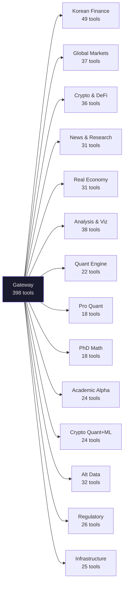

# Tool Catalog — 398 Tools across 64 Servers

> Complete reference for every tool in the Nexus Finance MCP platform.  
> For visual architecture, see [DATA_FLOW.md](DATA_FLOW.md). For a cheat sheet, see [QUICK_REFERENCE.md](QUICK_REFERENCE.md).

---

## Domain Overview

**Jump to:** [Korean Economy](#1-korean-economy-한국-경제--41-tools) | [Real Estate](#2-korean-real-estate-부동산--8-tools) | [Global Markets](#3-global-markets--37-tools) | [Crypto](#4-crypto--defi--36-tools) | [News](#5-news--research--31-tools) | [Real Economy](#6-real-economy--31-tools) | [Regulatory](#7-regulatory--environment--26-tools) | [Alt Data](#8-quant-alternative-data--32-tools) | [Viz](#9-analysis--visualization--38-tools) | [Quant](#10-quant-analysis-engine-phase-8--22-tools) | [Pro Quant](#11-professional-quant-phase-9--18-tools) | [PhD Math](#12-phd-level-quant-math-phase-10--18-tools) | [Academic Alpha](#13-academic-alpha-core-phase-11--24-tools) | [Crypto Quant+ML](#14-crypto-quant--ml-pipeline-phase-12--24-tools) | [Infrastructure](#15-infrastructure--knowledge--25-tools)

---

## Complexity Tiers

### Tier 1: Simple (86 tools) — 0-1 params, direct lookup

Instant results. No data transformation required.

| Type | Count | Examples |
|------|-------|---------|
| Zero-param Snapshots | 52 | `ecos_get_macro_snapshot()`, `gateway_status()`, `crypto_fear_greed()` |
| stock_code single lookup | 34 | `dart_company_info("005930")`, `stocks_quote("005930")` |

### Tier 2: Parameterized (~120 tools) — 2-4 params, date/filter

Date ranges, keywords, filter conditions required.

| Type | Count | Examples |
|------|-------|---------|
| keyword search | 24 | `ecos_search_stat_list("금리")`, `academic_search("GARCH")` |
| date range query | ~50 | `ecos_get_base_rate(start_date, end_date)`, `stocks_history(...)` |
| filter combination | ~46 | `crypto_ohlcv(symbol, timeframe)`, `energy_oil_price(period)` |

### Tier 3: Analytical (~80 tools) — complex input, computed output

Takes pre-collected data as input and performs analysis.

| Type | Count | Examples |
|------|-------|---------|
| Correlation/causal | 8 | `quant_lagged_correlation(series1, series2)` |
| Time series | 6 | `ts_forecast(series, horizon)`, `ts_decompose(series)` |
| Backtest | 8 | `backtest_run(stock, strategy, years)` |
| Factor analysis | 6 | `factor_momentum_score(returns)` |
| Portfolio optimization | 6 | `portfolio_markowitz(returns, cov_matrix)` |
| Valuation | 10 | `val_dcf_valuation(...)`, `val_peer_comparison(...)` |
| Visualization | 33 | `viz_line_chart(data, x_column, y_columns)` |

### Tier 4: Pipeline (~78 tools) — multi-stage, chained input

Output of one tool becomes input of the next.

| Type | Count | Examples |
|------|-------|---------|
| Signal Lab | 6 | `signal_scan(...)`, `signal_combine(...)`, `signal_walkforward(...)` |
| Portfolio Advanced | 6 | `portadv_black_litterman(...)`, `portadv_hrp(...)` |
| Volatility Models | 6 | `vol_garch(...)`, `vol_heston(...)`, `vol_hmm_regime(...)` |
| Advanced Math | 6 | `math_kalman_filter(...)`, `math_wavelet(...)` |
| Statistical Arb | 6 | `stat_arb_ou_fit(...)`, `stat_arb_copula(...)` |
| Stochastic Vol | 6 | `stochvol_heston(...)`, `stochvol_almgren_chriss(...)` |
| Microstructure | 6 | `micro_kyle_lambda(...)`, `micro_vpin(...)` |
| Crypto Quant | 6 | `cquant_funding_rate(...)`, `cquant_basis_term(...)` |
| OnChain Advanced | 6 | `onchain_mvrv(...)`, `onchain_hodl_waves(...)` |
| ML Pipeline | 6 | `ml_volume_bars(...)`, `ml_triple_barrier(...)`, `ml_purged_cv(...)` |
| Alpha Research | 6 | `alpha_turnover(...)`, `alpha_crowding(...)`, `alpha_combine(...)` |
| 150-year Historical | 6 | `hist_shiller_data()`, `hist_french_factors()`, `hist_nber_cycles()` |

---

## Domain Catalog

### 1. Korean Economy (한국 경제) — 43 tools

| Server | Count | Tools | Data Source |
|--------|-------|-------|------------|
| **ECOS** | 9 | `ecos_search_stat_list`, `ecos_get_stat_data`, `ecos_get_base_rate`, `ecos_get_m2`, `ecos_get_gdp`, `ecos_get_macro_snapshot`, `ecos_get_exchange_rate`, `ecos_get_bond_yield`, `ecos_list_indicators` | 한국은행 ECOS |
| **KOSIS** | 5 | `kosis_search_tables`, `kosis_get_population`, `kosis_get_unemployment`, `kosis_get_housing_price`, `kosis_get_table` | 통계청 KOSIS |
| **DART** | 22 | `dart_company_info`, `dart_financial_statements`, `dart_financial_ratios`, `dart_major_shareholders`, `dart_search_company`, `dart_cash_flow`, `dart_dividend`, `dart_executives`, `dart_executive_compensation`, `dart_shareholder_changes`, `dart_capital_changes`, `dart_mergers`, `dart_convertible_bonds`, `dart_treasury_stock`, `dart_related_party`, `dart_5pct_disclosure`, `dart_disclosure_search`, `dart_events`, `dart_full_financial`, `dart_document`, **`dart_financial_multi_year`** ★, **`dart_equity_analysis`** ★ | 금융감독원 OpenDART |
| **FSC** | 2 | `fsc_stock_price`, `fsc_bond_price` | 금융위원회 data.go.kr |
| **Stocks** | 5 | `stocks_quote`, `stocks_search`, `stocks_history`, `stocks_beta`, `stocks_market_overview` | KIS + pykrx + Yahoo |

> ★ **New tools:**
> - `dart_financial_multi_year(stock_code, years=5)` — 5~10개년 재무제표 자동 병합. DART 3년 제한 자동 우회.
> - `dart_equity_analysis(stock_code)` — 1회 호출로 기업개황 + 재무제표 + 재무비율 + 현금흐름 + 배당 통합 조회.

### 2. Korean Real Estate (부동산) — 8 tools

| Server | Count | Tools | Data Source |
|--------|-------|-------|------------|
| **R-ONE** | 6 | `rone_get_apt_price_index`, `rone_get_jeonse_index`, `rone_get_pir`, `rone_get_price_comparison`, `rone_get_market_summary`, `rone_list_regions` | KOSIS (부동산원 orgId=408) |
| **Realestate** | 2 | `realestate_apt_trades`, `realestate_sigungu_codes` | 국토부 MOLIT |

### 3. Global Markets — 37 tools

| Server | Count | Tools | Data Source |
|--------|-------|-------|------------|
| **Global Macro** | 10 | `macro_oecd`, `macro_imf`, `macro_bis`, `macro_worldbank`, `macro_datasets`, `macro_search_indicators`, `macro_country_compare`, `macro_fred`, `macro_fred_search`, `macro_korea_snapshot` | OECD, IMF, BIS, World Bank, FRED |
| **US Equity** | 4 | `us_stock_quote`, `us_company_profile`, `us_economic_calendar`, `us_market_news` | Finnhub |
| **Asia Market** | 8 | `asia_china_quote`, `asia_china_index`, `asia_china_history`, `asia_taiwan_quote`, `asia_taiwan_index`, `asia_hk_quote`, `asia_hk_index`, `asia_market_overview` | Yahoo Finance |
| **India** | 3 | `india_stock_quote`, `india_index`, `india_stock_history` | Yahoo Finance |
| **SEC** | 8 | `sec_company_filings`, `sec_company_facts`, `sec_xbrl_concept`, `sec_list_concepts`, `sec_filing_text`, `sec_submission_metadata`, `sec_insider_transactions`, `sec_institutional_holders` | SEC EDGAR |
| **EDINET** | 4 | `edinet_filings`, `edinet_company`, `edinet_document`, `edinet_search` | 일본 EDINET |

### 4. Crypto & DeFi — 36 tools

| Server | Count | Tools | Data Source |
|--------|-------|-------|------------|
| **Crypto Exchange** | 14 | `crypto_ticker`, `crypto_orderbook`, `crypto_ohlcv`, `crypto_all_tickers`, `crypto_kimchi_premium`, `crypto_exchange_compare`, `crypto_volume_ranking`, `crypto_spread`, `crypto_list_exchanges`, `crypto_list_symbols`, `crypto_recent_trades`, `crypto_funding_rate`, `crypto_ticker_24h`, `crypto_market_structure` | CCXT (100+ exchanges) |
| **Hist Crypto** | 3 | `crypto_daily_history`, `crypto_hourly_history`, `crypto_top_coins` | CoinGecko |
| **DeFi** | 4 | `defi_protocols`, `defi_protocol_detail`, `defi_chains`, `defi_feargreed` | DefiLlama |
| **OnChain** | 3 | `onchain_balance`, `onchain_transactions`, `onchain_gas` | Etherscan |
| **OnChain Advanced** | 6 | `onchain_adv_exchange_flow`, `onchain_adv_mvrv`, `onchain_adv_realized_cap`, `onchain_adv_hodl_waves`, `onchain_adv_whale_alert`, `onchain_adv_nvt` | Blockchain.com |
| **Crypto Quant** | 6 | `cquant_funding_rate`, `cquant_basis_term`, `cquant_funding_arb`, `cquant_open_interest`, `cquant_liquidation_levels`, `cquant_carry_backtest` | CCXT Derivatives |

### 5. News & Research — 31 tools

| Server | Count | Tools | Data Source |
|--------|-------|-------|------------|
| **News** | 4 | `news_search`, `news_trend`, `news_market_sentiment`, `news_keyword_volume` | Naver API |
| **Global News** | 3 | `global_news_search`, `global_news_timeline`, `global_news_korea` | GDELT |
| **RSS** | 4 | `rss_financial_news`, `rss_search_news`, `rss_available_feeds`, `rss_crypto_news` | Bloomberg, WSJ, CNBC, Reuters, FT 등 14개 피드 |
| **Academic** | 9 | `academic_arxiv`, `academic_semantic_scholar`, `academic_openalex`, `academic_multi_search`, `academic_trending`, `academic_paper_detail`, `academic_citations`, `academic_author`, `academic_concepts` | arXiv, Semantic Scholar, OpenAlex |
| **Research** | 6 | `research_riss`, `research_nkis`, `research_prism`, `research_nl`, `research_nanet`, `research_scholar` | RISS, NKIS, PRISM, 국립중앙도서관, NANET |
| **Sentiment** | 5 | `sentiment_google_trends`, `sentiment_wiki_pageviews`, `sentiment_news_score`, `sentiment_fear_greed_multi`, `sentiment_keyword_correlation` | pytrends, Wikipedia, VADER |

### 6. Real Economy — 31 tools

| Server | Count | Tools | Data Source |
|--------|-------|-------|------------|
| **Energy** | 9 | `energy_crude_oil`, `energy_natural_gas`, `energy_price_snapshot`, `energy_eia_series`, `energy_electricity`, `energy_bunker_fuel`, `energy_opec_production`, `energy_weather_forecast`, `energy_weather_cities` | EIA + Open-Meteo |
| **Agriculture** | 7 | `agri_kamis_prices`, `agri_fao_info`, `agri_product_codes`, `agri_snapshot`, `agri_fao_production`, `agri_fao_trade`, `agri_usda_psd` | KAMIS + FAO + USDA |
| **Maritime** | 4 | `maritime_bdi`, `maritime_container_index`, `maritime_ports`, `maritime_freight_snapshot` | FRED |
| **Aviation** | 3 | `aviation_departures`, `aviation_live_aircraft`, `aviation_korea_airports` | OpenSky |
| **Trade** | 3 | `trade_korea_exports`, `trade_korea_imports`, `trade_country_codes` | UN Comtrade |
| **Consumer** | 4 | `consumer_us_retail`, `consumer_us_sentiment`, `consumer_us_housing`, `consumer_eu_hicp` | FRED + Eurostat |
| **Prediction** | 3 | `prediction_markets`, `prediction_market_detail`, `prediction_events` | Polymarket |

### 7. Regulatory & Environment — 26 tools

| Server | Count | Tools | Data Source |
|--------|-------|-------|------------|
| **Valuation** | 10 | `val_calculate_wacc`, `val_dcf_valuation`, `val_dcf_sample`, `val_sensitivity_analysis`, `val_peer_comparison`, `val_peer_comparison_sample`, `val_cross_market_comparison`, `val_normalize_gaap`, `val_get_market_assumptions`, `val_refresh_market_data` | DART + ECOS |
| **Regulation** | 4 | `regulation_eu_search`, `regulation_eu_text`, `regulation_key_financial`, `regulation_finra_info` | EUR-Lex + FINRA |
| **Politics** | 3 | `politics_bills`, `politics_recent_bills`, `politics_finance_bills` | 국회 API |
| **Health** | 5 | `health_fda_drugs`, `health_fda_recalls`, `health_clinical_trials`, `health_pubmed_search`, `health_who_indicators` | openFDA + NCBI + WHO |
| **Environ** | 2 | `environ_epa_air_quality`, `environ_carbon_price` | EPA + KRBN ETF |
| **Patent** | 2 | `patent_search`, `patent_trending` | KIPRIS |

### 8. Quant Alternative Data — 32 tools

| Server | Count | Tools | Data Source | API Key |
|--------|-------|-------|------------|---------|
| **Space Weather** | 5 | `space_sunspot_data`, `space_solar_flares`, `space_geomagnetic`, `space_solar_wind`, `space_cme_events` | SILSO + NASA + NOAA | Not required |
| **Disaster** | 6 | `disaster_earthquakes`, `disaster_volcanoes`, `disaster_wildfires`, `disaster_floods`, `disaster_active_events`, `disaster_history` | USGS + NASA EONET + GDACS | Not required |
| **Climate** | 6 | `climate_historical_weather`, `climate_temperature_anomaly`, `climate_extreme_events`, `climate_enso_index`, `climate_city_comparison`, `climate_crop_weather` | Open-Meteo + NASA GISS | Not required |
| **Conflict** | 5 | `conflict_active_wars`, `conflict_battle_deaths`, `conflict_country_risk`, `conflict_peace_index`, `conflict_geopolitical_events` | UCDP + GPI | Token required |
| **Power Grid** | 5 | `power_grid_eu_generation`, `power_grid_eu_price`, `power_grid_carbon_intensity`, `power_grid_nuclear_status`, `power_grid_renewable_forecast` | ENTSO-E + EIA | Optional |

### 9. Analysis & Visualization — 38 tools

| Server | Count | Tools | Data Source |
|--------|-------|-------|------------|
| **Technical** | 5 | `ta_indicators`, `ta_rsi`, `ta_macd`, `ta_bollinger`, `ta_summary` | pykrx |
| **Viz** | 33 | **Basic (10):** `viz_line_chart`, `viz_bar_chart`, `viz_candlestick`, `viz_heatmap`, `viz_scatter`, `viz_waterfall`, `viz_dual_axis`, `viz_pie_chart`, `viz_correlation_matrix`, `viz_sensitivity_heatmap` | Plotly + Matplotlib |
| | | **Advanced (8):** `viz_radar`, `viz_bubble`, `viz_lollipop`, `viz_slope`, `viz_parallel`, `viz_combo`, `viz_gantt`, `viz_marimekko` | |
| | | **Hierarchical (6):** `viz_treemap`, `viz_sunburst`, `viz_funnel`, `viz_gauge`, `viz_bullet`, `viz_sankey` | |
| | | **Map (3):** `viz_map_choropleth`, `viz_map_scatter`, `viz_map_flow` | |
| | | **Statistical (6):** `viz_area_chart`, `viz_stacked_bar`, `viz_histogram`, `viz_box_plot`, `viz_violin`, `viz_density` | |

### 10. Quant Analysis Engine (Phase 8) — 22 tools

| Server | Count | Tools | Description |
|--------|-------|-------|-------------|
| **Quant Analysis** | 8 | `quant_correlation`, `quant_lagged_correlation`, `quant_regression`, `quant_granger_causality`, `quant_cointegration`, `quant_var_decomposition`, `quant_event_study`, `quant_regime_detection` | Relationship analysis between any two series |
| **Time Series** | 6 | `ts_decompose`, `ts_stationarity`, `ts_forecast`, `ts_seasonality`, `ts_changepoint`, `ts_cross_correlation` | Pattern analysis & ARIMA forecasting |
| **Backtest** | 8 | `backtest_run`, `backtest_compare`, `backtest_optimize`, `backtest_portfolio`, `backtest_benchmark`, `backtest_risk`, `backtest_signal_history`, `backtest_drawdown` | Full simulation with fees & taxes |

### 11. Professional Quant (Phase 9) — 18 tools

| Server | Count | Tools | Description |
|--------|-------|-------|-------------|
| **Factor Engine** | 6 | `factor_score`, `factor_backtest`, `factor_correlation`, `factor_exposure`, `factor_timing`, `factor_custom` | Fama-French style factor analysis |
| **Signal Lab** | 6 | `signal_scan`, `signal_combine`, `signal_decay`, `signal_capacity`, `signal_regime_select`, `signal_walkforward` | Alpha signal discovery + ensemble |
| **Portfolio Optimizer** | 6 | `portfolio_optimize`, `portfolio_risk_parity`, `portfolio_kelly`, `portfolio_correlation_matrix`, `portfolio_stress_test`, `portfolio_rebalance` | Markowitz, risk parity, Kelly criterion |

### 12. PhD-Level Quant Math (Phase 10) — 18 tools

| Server | Count | Tools | Description |
|--------|-------|-------|-------------|
| **Historical Data** | 6 | `historical_shiller`, `historical_french_factors`, `historical_nber_cycles`, `historical_fred_century`, `historical_gold_oil`, `historical_crisis_comparison` | 150-year data (Shiller 1871~, NBER 1854~) |
| **Volatility Model** | 6 | `vol_garch`, `vol_egarch`, `vol_surface`, `vol_regime`, `vol_forecast_ensemble`, `vol_vix_term` | GARCH, EGARCH, HMM regime, VIX term structure |
| **Advanced Math** | 6 | `math_kalman`, `math_hurst`, `math_entropy`, `math_wavelets`, `math_fractal`, `math_monte_carlo` | Kalman filter, Hurst, entropy, wavelets, fractal, MC |

### 13. Academic Alpha Core (Phase 11) — 24 tools

| Server | Count | Tools | Key Methods |
|--------|-------|-------|-------------|
| **Stat Arb** | 6 | `stat_arb_ou_fit`, `stat_arb_pairs_distance`, `stat_arb_spread_zscore`, `stat_arb_copula`, `stat_arb_halflife`, `stat_arb_backtest` | OU MLE, Gatev distance, Clayton/Gumbel copula |
| **Portfolio Advanced** | 6 | `portadv_rmt_clean`, `portadv_black_litterman`, `portadv_hrp`, `portadv_johansen`, `portadv_info_theory`, `portadv_compare` | Marchenko-Pastur, BL posterior, HRP, transfer entropy |
| **StochVol** | 6 | `stochvol_heston`, `stochvol_jump_diffusion`, `stochvol_var_premium`, `stochvol_exec_optimal`, `stochvol_exec_vwap`, `stochvol_impact` | Heston calibration, Merton jump, Almgren-Chriss |
| **Microstructure** | 6 | `micro_kyle_lambda`, `micro_lee_ready`, `micro_roll_spread`, `micro_amihud`, `micro_orderbook_imbalance`, `micro_toxicity` | Kyle's lambda, VPIN, trade classification |

### 14. Crypto Quant + ML Pipeline (Phase 12) — 24 tools

| Server | Count | Tools | Key Methods |
|--------|-------|-------|-------------|
| **Crypto Quant** | 6 | `cquant_funding_rate`, `cquant_basis_term`, `cquant_funding_arb`, `cquant_open_interest`, `cquant_liquidation_levels`, `cquant_carry_backtest` | Perp funding, cash-and-carry, leverage cascade |
| **OnChain Advanced** | 6 | `onchain_adv_exchange_flow`, `onchain_adv_mvrv`, `onchain_adv_realized_cap`, `onchain_adv_hodl_waves`, `onchain_adv_whale_alert`, `onchain_adv_nvt` | MVRV, NVT, HODL waves, BDD ratio |
| **ML Pipeline** | 6 | `mlpipe_volume_bars`, `mlpipe_frac_diff`, `mlpipe_triple_barrier`, `mlpipe_meta_label`, `mlpipe_purged_cv`, `mlpipe_feature_importance` | Lopez de Prado AFML full pipeline |
| **Alpha Research** | 6 | `alpha_turnover`, `alpha_decay`, `alpha_crowding`, `alpha_capacity`, `alpha_regime_switch`, `alpha_combine` | Grinold-Kahn, IC decay, IR optimization |

### 15. Infrastructure & Knowledge — 25 tools

| Server | Count | Tools | Data Source |
|--------|-------|-------|------------|
| **Vault** | 6 | `vault_search`, `vault_read`, `vault_list`, `vault_recent`, `vault_tags`, `vault_write` | Obsidian Vault (PARA) |
| **Vault Index** | 3 | `vault_index`, `vault_semantic_search`, `vault_related` | Ollama bge-m3 |
| **Memory** | 5 | `memory_store`, `memory_search`, `memory_list`, `memory_forget`, `memory_stats` | SQLite + Ollama vector |
| **Ontology** | 5 | `ontology_map`, `ontology_chain`, `ontology_impact`, `ontology_suggest`, `ontology_save` | 17-domain knowledge graph |
| **Gateway** | 6 | `gateway_status`, `list_available_tools`, `api_call_stats`, `list_tools_by_domain`, `list_tools_by_pattern`, `tool_info` | Internal meta |

---

## Input Pattern Quick Reference

| Pattern | Count | Share | Identification | Prefix Examples |
|---------|-------|-------|----------------|-----------------|
| snapshot (0 params) | 52 | 14% | No parameters | `*_snapshot`, `*_status`, `*_active_*` |
| stock_code | 34 | 9% | `stock_code` required | `dart_*`, `stocks_*`, `val_*` |
| series | 28 | 8% | `series`/`series_list` required | `quant_*`, `ts_*`, `portadv_*`, `factor_*` |
| search | 24 | 7% | `keyword`/`query` required | `*_search*`, `academic_*` |
| data+columns | 33 | 9% | `data` + `columns` required | `viz_*` |
| composite | 225 | 53% | Domain-specific combinations | Various |

---

## Geographic Coverage

| Region | Tools | Primary Sources |
|--------|-------|-----------------|
| Korea | ~59 | BOK ECOS, DART, KOSIS, KRX, Naver |
| USA | ~25 | FRED, SEC, Finnhub, EIA |
| Asia | ~22 | Yahoo (HK, TW, CN, IN), EDINET (JP) |
| Europe | ~15 | EUR-Lex, ENTSO-E, Eurostat |
| Global | ~60+ | Crypto, OECD, IMF, BIS, NASA |

## Temporal Coverage

| Dataset | Start Year | Source |
|---------|-----------|--------|
| Shiller PE/Earnings | 1871 | Robert Shiller |
| Sunspot Number | 1818 | SILSO |
| French Factors | 1926 | Kenneth French |
| NBER Business Cycles | 1854 | NBER |
| Historical Weather | 1940 | Open-Meteo |
| Korean Macro | ~1990 | BOK ECOS |
